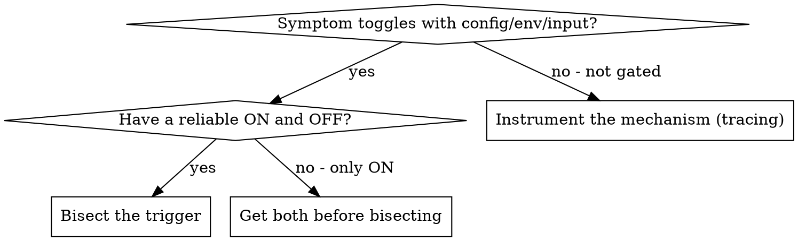
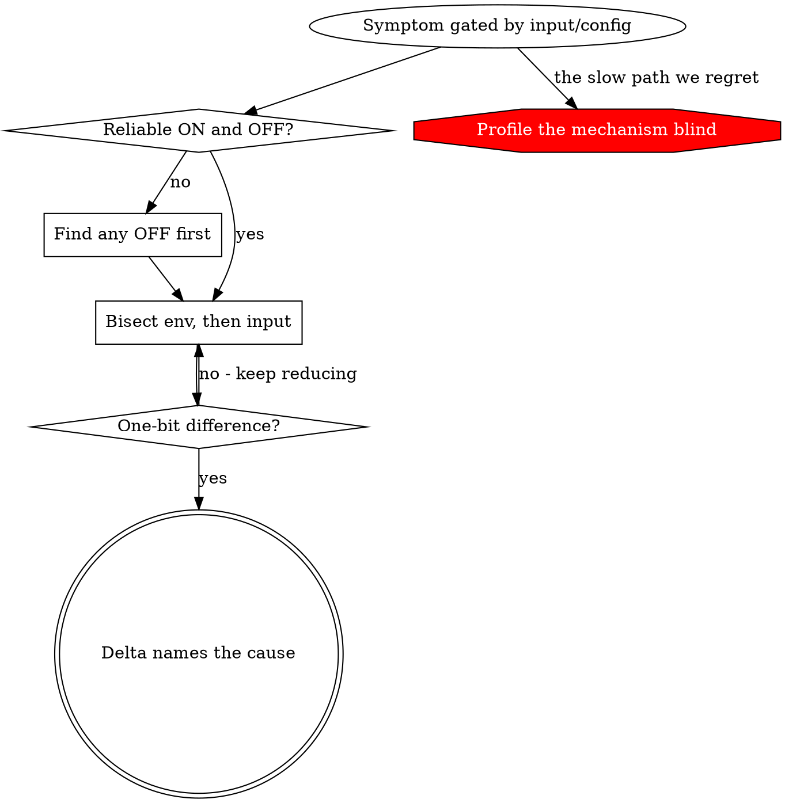

# Reducing the Trigger

## Overview

Root-cause-tracing works backward through the call stack from a known bad value.
But sometimes you don't have a bad value to trace - you have a symptom that
appears in one environment and not another, or with one input and not another,
and no idea which part of the input or environment is responsible. Instrumenting
the mechanism is expensive and, worse, presupposes you already know where to
look.

**Core principle:** When the failure is gated by an input or a configuration,
shrink it toward the minimal trigger BEFORE you instrument the mechanism. The
smallest change that flips the symptom on and off IS the root cause - or the
exact place to start looking. This needs zero understanding of the mechanism.

Root-cause-tracing is *additive*: add logging, trace values, build understanding.
This technique is *subtractive*: remove things until the symptom disappears, then
you have named the cause. They are complementary. Reach for this one first when
the bug is deterministic and gated by something you can turn off.

## When to Use



**Use when:**
- "Works on my machine / breaks on theirs" - the delta is somewhere in the environment
- A flag, a trusted/untrusted mode, a plugin, a config file toggles the symptom
- One input triggers it and a similar one doesn't
- The failure is deterministic but you cannot see why
- Instrumenting the mechanism would be slow, and you don't yet know where to instrument

**A configuration or input that reliably toggles the symptom is EVIDENCE, not
noise to control for.** The most common mistake is to notice "it only happens
when X is on," file that under lab hygiene ("remember to set X"), and go off to
profile the mechanism. Chasing the toggle is almost always faster.

## The Process

### 1. Establish a reliable ON and a reliable OFF

You cannot bisect with only a failing case. You need a repeatable trigger AND a
repeatable non-trigger. If you only have ON, your first job is to find any OFF -
the smallest change that makes the symptom vanish. That change is already a clue.

For noisy or intermittent systems: pin the ON. Repeat each arm several times,
require the control (OFF) to actually stay clean and the treatment (ON) to
actually reproduce, and interleave the arms (ON, OFF, ON, OFF) so drift in the
machine doesn't masquerade as an effect. One run proves nothing.

### 2. Bisect the environment / configuration

Halve what is enabled and see which half keeps the symptom.

```
Trusted project spins; untrusted does not.
  -> What does "trusted" turn on? hooks, project settings, plugins, MCP servers.
  -> Disable half. Still spins? The cause is in that half. Recurse.
  -> Narrows to: one plugin.
```

This requires no knowledge of *why* the plugin matters - only that toggling it
flips the symptom.

### 3. Bisect the input (delta-minimize)

Once you've localized to a component, shrink its input the same way. Remove
halves; keep the smallest slice that still triggers.

```
The plugin emits a multi-KB payload at startup.
  -> First half of the payload triggers; second half does not.
  -> Within the first half: the real text triggers; equal-sized filler does not.
  -> The real text minus its punctuation does not trigger.
  -> Filler PLUS one of those punctuation characters DOES.
  -> Minimal trigger: a single non-ASCII character.
```

This is delta debugging. At each step you have a strictly smaller failing case,
and the reduction is mechanical.

### 4. Cross the last gap to a one-bit difference

Push until ON and OFF differ by the smallest possible delta - one character, one
line, one flag, one byte. At that point the delta names the cause, or points a
laser at the one place to begin mechanism analysis.

## Critical Pitfall: build repros empty-up, not cloned-down

To keep a bug reproducible, the tempting move is to clone the entire failing
environment into a sandbox and preserve it. **This is a trap.** Start-full-and-
preserve guarantees you never observe the OFF state - and the OFF state is the
signal. If your minimized repro is built by subtracting from a full clone, you
are working against the grain.

Instead, build from a **minimal known-good** and add pieces until it breaks. The
piece whose addition breaks it (equivalently: whose removal fixes it) is the
answer. Empty HOME + add one config at a time beats full HOME + remove one at a
time, because the former reaches a clean minimal trigger and the latter often
never loses the bug at all.

## Interaction with Magnitude

Before you even bisect, a back-of-envelope magnitude check can delete whole
hypothesis classes. If the healthy case takes 1.5 seconds and the broken case
takes 10+ minutes, the cause is not "the same work, a bit slower" - it is a
different code path entirely (a runaway, an unbounded loop, a retry storm).
Suspects that would only add a constant factor are ruled out for free. Ask: does
the SIZE of the effect match the size of the cause I'm imagining?

## Real Example: a startup hang gated by one character

**Symptom:** an app pegs a core indefinitely at startup on one class of machine,
but only for "trusted" projects; a slightly older release is fine.

**Reduction (no mechanism understanding used):**
1. Trusted spins, untrusted doesn't -> trust gates hooks/plugins/settings.
2. Toggle plugins: one plugin on -> spins; off -> idles in 9s. (Interleaved, 5x.)
3. Keep the plugin; bisect its startup payload: full text spins, equal-size
   ASCII filler idles -> it's the CONTENT, not the size.
4. Bisect the content: the real text with its punctuation transliterated to
   ASCII idles; filler plus one em-dash spins.
5. Minimal trigger: a single character above U+00FF in the payload.

**Root cause (found AFTER, now knowing exactly where to look):** the wide
character forces the engine's 16-bit string path, whose ingestion loops forever
on that platform. **Fix:** transliterate ~6 punctuation characters.

The mechanism (a 16-bit-string pathology in one engine build on one CPU class)
was hard. Localizing the trigger to one character was easy, mechanical, and did
not require understanding the mechanism at all. Weeks of profiling the mechanism
were spent before anyone bisected the configuration.

## Key Principle



**When something toggles the symptom, reduce it to the minimal trigger before you
open a profiler.** Subtraction localizes faster than instrumentation.

## Relationship to Other Techniques

- **root-cause-tracing.md** - the additive complement. Once bisection points at a
  component, trace backward inside it to the source.
- **find-polluter.sh** - bisecting *which test* causes pollution is exactly this
  technique applied to test ordering.
- **defense-in-depth.md** - after the minimal trigger is known, validate against
  it at multiple layers.

## Real-World Impact

- Trigger localized to one character by mechanical bisection in well under a day.
- The same bug had absorbed weeks of mechanism-first profiling that never reached
  the cause, because the investigation kept asking "how is it slow?" instead of
  "what, minimally, turns it on?"
